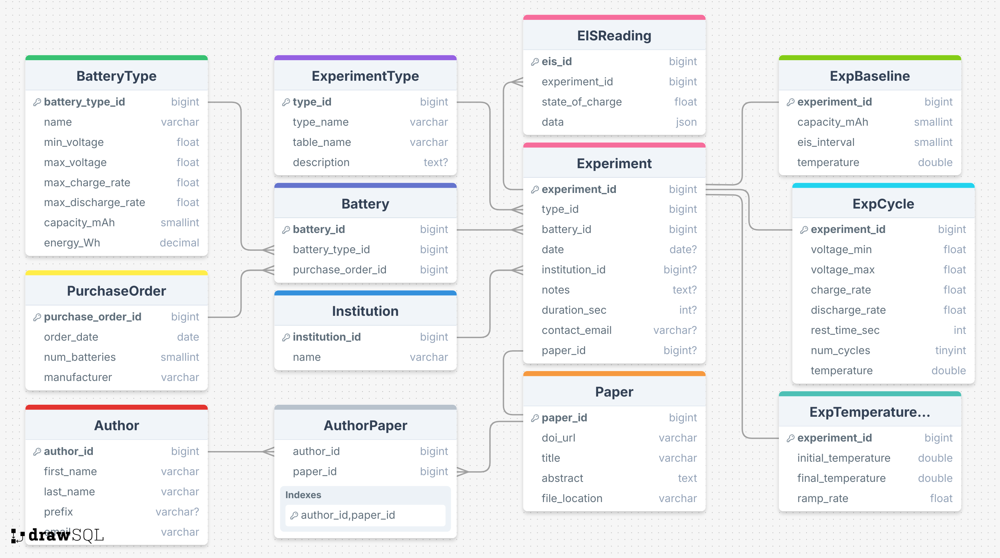
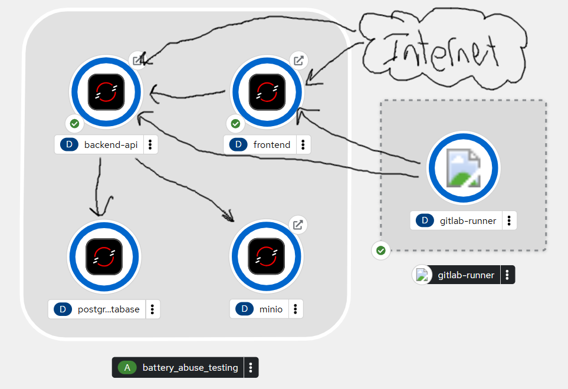

# The Battery Lab - Initial Design

## Project Purpose and Goals

### Overview
The Battery Lab is an interactive web platform designed to facilitate sharing and analysis of battery safety data for engineers and scientists. The platform addresses the critical challenge of data sharing for specific battery cells used in international research, particularly for overcharge testing, daily use monitoring, and electrochemical impedance spectroscopy (EIS) measurements.

### Primary Goals
- **Data Accessibility**: Provide an intuitive search interface for existing experimental and battery-related data
- **Visualization**: Offer high-quality, customizable data visualizations for research analysis
- **Data Upload**: Enable experimentalists to contribute new data and link to publications
- **API Access**: Support programmatic data access for AI/ML applications and algorithms
- **Research Integration**: Link papers and experiments through RAG search capabilities
- **Natural Language Querying**: Provide NLQ system for registered users to query data conversationally

### Target Users
- **General Users**: Researchers needing in-depth data search and visualization
- **Experimentalists**: Scientists uploading and contributing experimental data
- **AI/ML Researchers**: Developers building predictive algorithms for battery thermal runaway

## Entity-Relationship Design (ERD)

### Core Data Entities
The database schema includes the following interconnected entities for comprehensive battery research data management:

**Battery Management:**
- **BatteryType**: Defines battery specifications (voltage ranges, capacity, charge/discharge rates)
- **Battery**: Individual battery instances linked to types and purchase orders
- **PurchaseOrder**: Tracks battery procurement with manufacturer details

**Experiment Framework:**
- **ExperimentType**: Configurable experiment categories with table definitions
- **Experiment**: Core experimental records linking batteries, institutions, and papers
- **Institution**: Research organizations conducting experiments

**Research Publications:**
- **Paper**: Research publications with DOI, abstracts, and file locations
- **Author**: Individual researchers and their affiliations
- **AuthorPaper**: Junction table linking papers to multiple authors

**Experimental Data:**
- **EISReading**: Electrochemical Impedance Spectroscopy measurements with JSON data storage
- **ExpBaseline**: Baseline capacity and temperature measurements
- **ExpCycle**: Battery cycling data (voltage ranges, charge/discharge rates, cycle counts)
- **ExpTemperature**: Temperature ramping and thermal analysis data

**Key Relationships:**
- Battery → BatteryType (many-to-one)
- Experiment → Battery, Institution, Paper (many-to-one each)
- Experiment → EISReading, ExpBaseline, ExpCycle, ExpTemperature (one-to-many)
- Paper ↔ Author (many-to-many via AuthorPaper)

## System Design Architecture

### Technology Stack
- **Frontend**: TypeScript + Next.js
- **Backend API**: TypeScript + Fastify
- **Database**: PostgreSQL (long-term data storage)
- **File Storage**: MINIO (experimental data files)
- **Infrastructure**: RedHat OpenShift on Kubernetes
- **Scaling**: Horizontal scaling with separate frontend/backend scaling

## System Design Architecture

### Technology Stack
- **Frontend**: TypeScript + Next.js
- **Backend API**: TypeScript + Fastify
- **Database**: PostgreSQL (long-term data storage)
- **File Storage**: MINIO (experimental data files)
- **Infrastructure**: RedHat OpenShift on Kubernetes
- **CI/CD**: GitLab Runner for automated deployments
- **Scaling**: Horizontal scaling with separate frontend/backend scaling

### System Components

#### Core Application Layer
The main application runs within a containerized environment containing four primary services:

**Frontend Service**
- Next.js application serving the user interface
- Handles user authentication and session management
- Provides interactive data visualization and search capabilities
- Responsive design for researchers and experimentalists

**Backend API Service**
- Fastify-based REST API handling all business logic
- Manages data operations, file uploads, and user requests
- Implements authentication, authorization, and data validation
- Optimized for high-performance concurrent access

**PostgreSQL Database**
- Primary data store for all structured experimental data
- Handles complex relationships between experiments, batteries, and publications
- Supports JSON data storage for flexible EIS measurements
- Implements proper indexing for fast query performance

**MINIO File Storage**
- Object storage for large experimental data files
- Provides distributed, scalable file storage
- Integrates with API for secure file access
- Supports versioning and metadata management

#### Supporting Infrastructure

**GitLab Runner (CI/CD)**
- Automated testing and deployment pipeline
- Container image building and registry management
- Environment-specific deployment configurations
- Integration testing between services

**Battery Abuse Testing Integration**
- External system integration for real-time data ingestion
- Specialized component for handling abuse testing data streams
- Direct connection to experimental equipment

### Data Flow Architecture
1. **User Interaction**: Internet → Frontend → Backend API
2. **Data Storage**: Backend API ↔ PostgreSQL + MINIO
3. **File Operations**: Frontend → Backend API → MINIO
4. **External Data**: Battery Abuse Testing → Backend API → Database
5. **Deployment**: GitLab Runner → All containerized services

### Scaling Strategy
- **Horizontal Scaling**: Independent scaling of frontend and backend services
- **Path-based Routing**: Separate traffic routing for web UI vs. API access
- **Resource Optimization**: API-only requests bypass frontend resource allocation
- **Load Balancing**: Kubernetes-managed load distribution across service instances

